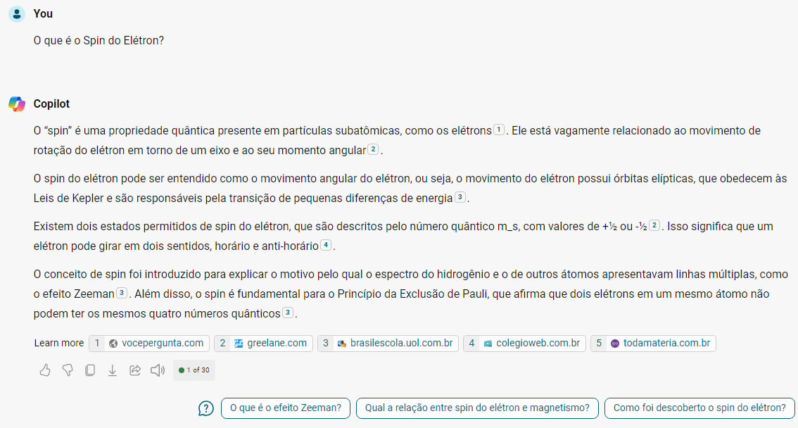
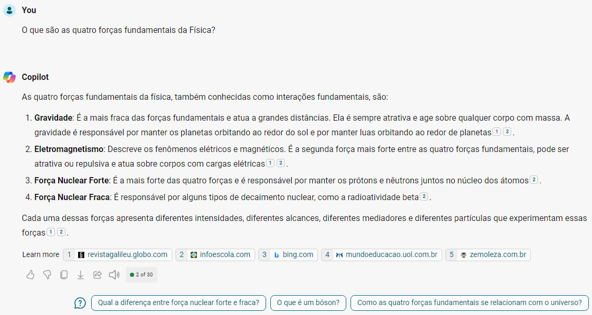
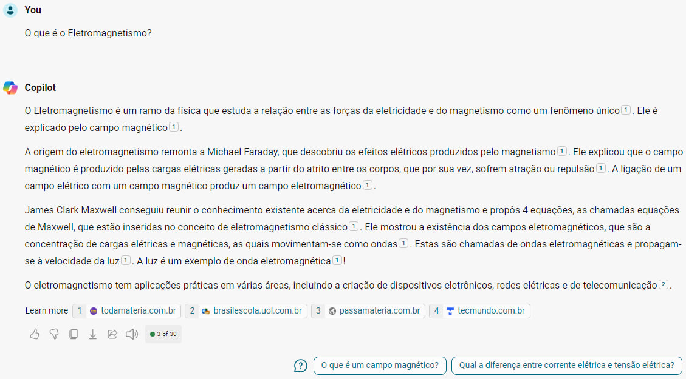

# Web Dio Azure Copilot

Projeto demonstrando o uso do Microsoft Copilot. Ele é um assistente de inteligência artificial projetado para ajudar os usuários fornecendo informações, respondendo a perguntas e participando de conversas. Ele usa tecnologias como GPT-4 e Bing Search para fornecer respostas relevantes e úteis.

Além disso, o Copilot é capaz de gerar conteúdo imaginativo e inovador, como poemas, histórias, códigos, ensaios, músicas, paródias de celebridades e muito mais. Ele também pode ajudar os usuários a escrever, reescrever, melhorar ou otimizar seu conteúdo. Ele também segue rigorosas diretrizes de segurança e privacidade para garantir que as interações sejam seguras e respeitosas.

# Entrada de prompts no chat com o Copilot e suas respectivas saídas

# 1 - O que é o Spin do Elétron?

# 2 - O que são as quatro forças fundamentais da Física?

# 3 - O que é o Eletromagnetismo?

# 4 - Imagens gerada a partir do prompt 'Space image of a black hole eating the planet earth'

# 5 - Imagens geradas a partir do prompt 'Image of a Spin of Electron'

